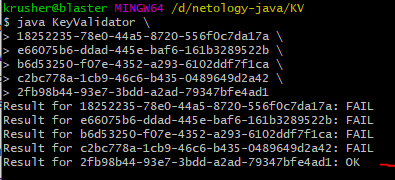

#Проверка валидации ключей с использованием программы KeyValidate.class

> ##**Тест план:**
> 1. произвести установку Java SDK по [инструкции](https://github.com/netology-code/javaqa-homeworks/blob/master/intro/openjdk11-manual.md "нажмите для перехода")
> 1. произвести проверку ключей из списка указанных на [странице](https://github.com/netology-code/javaqa-homeworks/blob/master/intro/user-manual.md "нажмите для перехода")
> 1. отправить отчет/багрепорт о проверке.

***

> ##**Отчет:**
> ###Установка JavaSDK. 
>1. установка Java SDK по инструкции прошла успешно. Ошибок в инструкции не вывлено.
>1. Проверка ключей из списка: 
>
>- для проверки ключей с использование программы KeyValidate.class необходимо дополнить инструкцию. Создан отдельно issue
>- список ключей имеет две группы: валидные ключи и не валидные:
>	- проверка валидных ключей не пройдена. создан отдельный issue
>	
>	
>	
>    - проверка не валидных ключей не пройдена. создан отдельный issue
>   
>	

