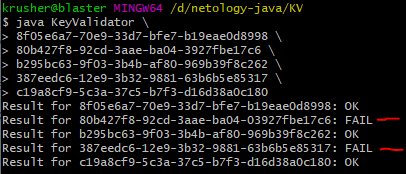
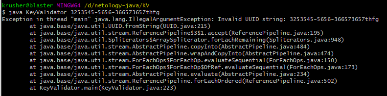

#Проверка валидации ключей с использованием программы KeyValidate.class

> ##**Тест план:**
> 1. произвести установку Java SDK по [инструкции](https://github.com/netology-code/javaqa-homeworks/blob/master/intro/openjdk11-manual.md "нажмите для перехода")
> 1. произвести проверку ключей из списка указанных на [странице](https://github.com/netology-code/javaqa-homeworks/blob/master/intro/user-manual.md "нажмите для перехода")
> 1. отправить отчет/багрепорт о проверке.

***

> ##**Отчет:**
> ###Установка JavaSDK. 
>1. установка Java SDK по инструкции прошла успешно. Ошибок в инструкции не вывлено.
>1. Проверка ключей из списка: 
>
>- для проверки ключей с использование программы KeyValidate.class необходимо дополнить инструкцию. Создан отдельно issue #1
>- список ключей имеет две группы: валидные ключи и не валидные:
>	- проверка валидных ключей не пройдена. создан отдельный issue #2
>	
>	
>	
>    - проверка не валидных ключей не пройдена. создан отдельный issue #3
>   
>	
>
>- при вводе рандомного ключа, не из списка, приложение выдает ошибку. создан отдельный issue #4. Данный тест был запущен по самостотельной инициативе. в задачах этого небыло
>
>   

***

>####Время потраченное на тестирование 30 минут, с учетом установки Java SDK.
>#####было проведено функциональное тестирование на основе требований. 